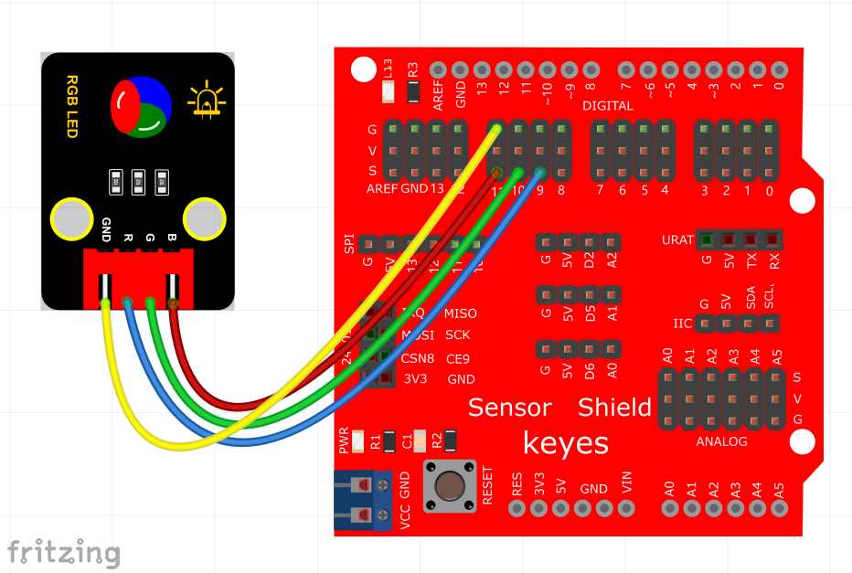

# KidsBlock

## 1. Kidsblock简介  

Kidsblock是一款为儿童和初学者设计的可视化编程平台，旨在通过图形化的积木模块帮助用户轻松学习编程基础。它结合Arduino及其他智能硬件，提供了动手制作的实践机会，允许用户通过控制传感器和执行简单任务来理解编程和机器人技术的基本原理。Kidsblock使学习变得更加有趣，同时培养了孩子们的创造力和动手能力。  

## 2. Kidsblock的主要功能  

1. **可视化编程**：  
   - 用户通过简单的积木模块组成程序，避免了编程的复杂性。  
   - 理解编程逻辑和控制结构变得简单直观。  

2. **丰富的项目示例**：  
   - 提供多样的项目，涵盖从基础到高级各个层面，帮助用户在实践中学习。  

3. **多种硬件支持**：  
   - 兼容Arduino及其他设备，允许用户探索更广泛的技术应用。  
   - 提供扩展可能性，用户可以添加额外模块以增加功能。  

## 3. 接线图  

  

## 4. 测试代码  

代码1：  

  

代码2：  

  

## 5. 代码说明  

代码1说明：  

1. 我们这里R接数字口9，G接数字口10，B接数字口11，所以我们将管脚设置为，其中RGB代表控制模块上LED对应的红绿蓝3种颜色对应的端口。根据接线图，我们接到了D9 D10 D11，设置为9 10 11。后面设置对应高低，设置RGB LED中红绿蓝3个灯是否会亮，设置为高（共阴RGB对应数字口为高电平，共阳则相反），对应的颜色就会亮起。  

2. 这个代码非常简单，只是控制模块上RGB LED显示红色1秒、绿色1秒、蓝色1秒，循环交替。  

代码2说明：  

同样我们这里R接数字口9，G接数字口10，B接数字口11，但这里所用的信号输出代码块为PWM输出，所以我们将管脚设置为。后面设置数据代表设置模块上LED红绿蓝颜色的比例，设置的数据越大（对应的PWM值越大），设置该颜色的比例越大。  

## 6. 常用RGB颜色表  

| 颜色名称  | R   | G   | B   |  
|-----------|-----|-----|-----|  
| 黑色      | 0   | 0   | 0   |  
| 黄色      | 255 | 255 | 0   |  
| 浅灰蓝色  | 176 | 224 | 230 |  
| 灰色      | 192 | 192 | 192 |  
| 白色      | 255 | 255 | 255 |  
| 红色      | 255 | 0   | 0   |  
| 绿色      | 0   | 255 | 0   |  
| 蓝色      | 0   | 0   | 255 |  

*注：上表展示了部分常用的RGB颜色及其对应的数值。*  

## 7. 测试结果  

上传测试代码1成功，上电后，模块上RGB LED循环显示红绿蓝3种颜色，间隔时间为1秒。上传测试代码2成功，上电后，模块上RGB LED显示红橙黄绿蓝青紫白7种颜色，循环不止，间隔时间为1秒。

