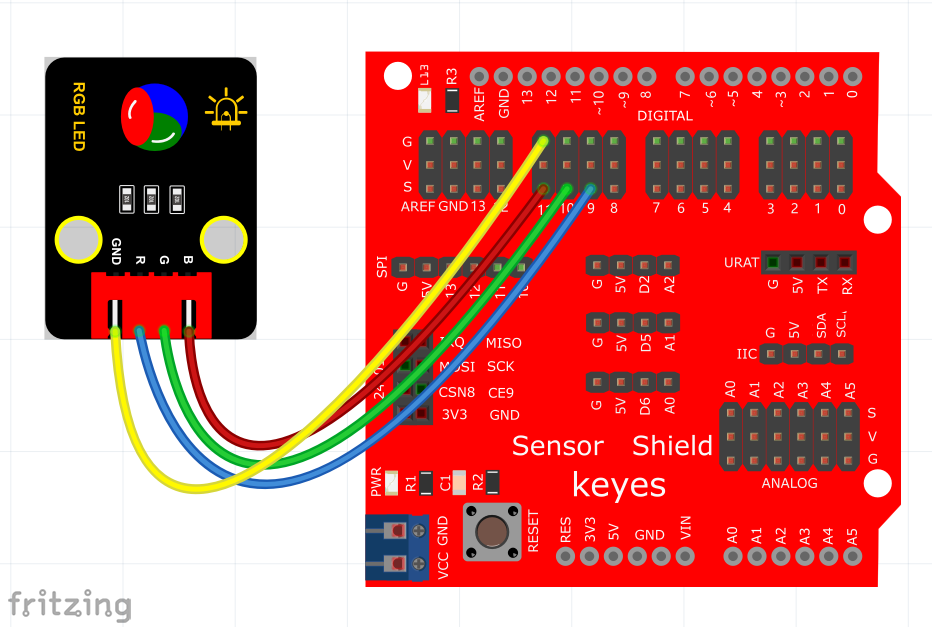
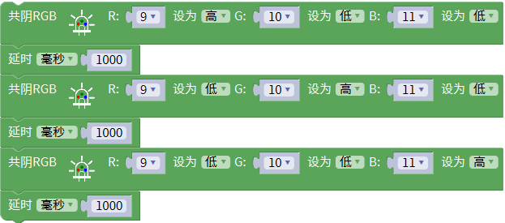
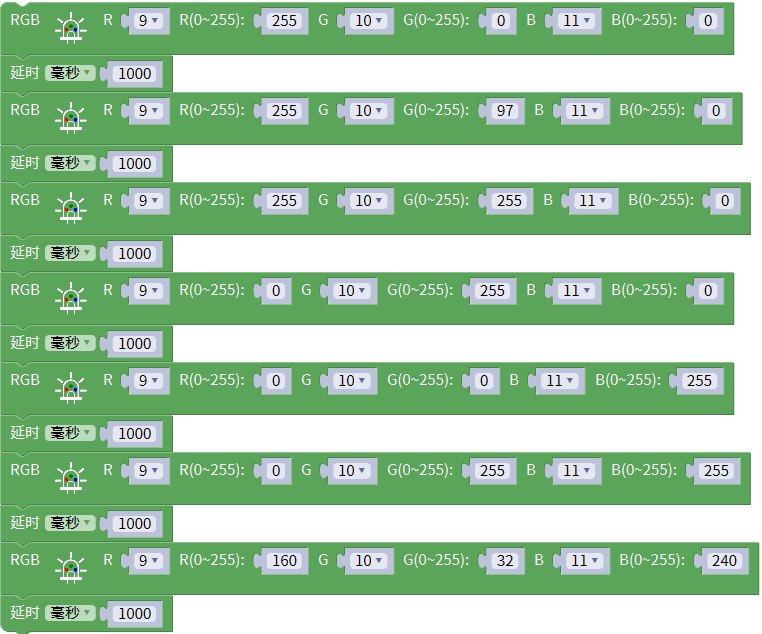

# Mixly

## 1. Mixly简介  

Mixly是一款面向初学者和儿童的可视化编程工具，提供图形化的编程界面，使用户能够简单地学习编程基础。这款工具通过拖拽代码模块，帮助用户快速搭建程序，降低了学习编程的门槛。Mixly支持多种编程语言，包括Arduino、C、Scratch等，适合各种硬件平台，如Arduino、Micro:bit等。  

Mixly的目标是培养用户的创造力和逻辑思维能力，让他们在实操中探索和理解编程与电子技术的原理，并提供丰富的项目示例和教程，以增强学习的趣味性和有效性。  

## 2. 项目展示  

2.1. 接线图  

  

2.2. 测试代码  

代码1  

  

代码2  

  

## 3. 代码说明  

3.1 代码1说明：  

1. 在“keyes sensor”库下找到共阴RGB模块，其中R接数字口9，G接数字口10，B接数字口11。相应的管脚设置为9、10、11，后面设置高低电平，使RGB LED的红绿蓝三种颜色交替闪烁，显示红色、绿色和蓝色各1秒。  
   
3.2 代码2说明：  

同样在“keyes sensor”库下找到共阴RGB模块，确认R、G、B的连接方式后，再根据比例值设置RGB LED的颜色。通过调整比例值来实现不同颜色的显示。  

## 4. 常用RGB颜色表  

|           | R   | G   | B   |           | R   | G   | B   |           | R   | G   | B   |  
|-----------|-----|-----|-----|-----------|-----|-----|-----|-----------|-----|-----|-----|  
| 黑色      | 0   | 0   | 0   | 黄色      | 255 | 255 | 0   | 浅灰蓝色  | 176 | 224 | 230 |  
| 象牙黑    | 41  | 36  | 33  | 香蕉色    | 227 | 207 | 87  | 品蓝      | 65  | 105 | 225 |  
| 灰色      | 192 | 192 | 192 | 镉黄      | 255 | 153 | 18  | 石板蓝    | 106 | 90  | 205 |  
| 冷灰      | 128 | 138 | 135 | dougello  | 235 | 142 | 85  | 天蓝      | 135 | 206 | 235 |  
| 石板灰    | 112 | 128 | 105 | forum gold | 255 | 227 | 132 |           |     |     |     |  
| 暖灰色    | 128 | 128 | 105 | 金黄色    | 255 | 215 | 0   | 青色      | 0   | 255 | 255 |  
|           |     |     |     | 黄花色    | 218 | 165 | 105 | 绿土      | 56  | 94  | 15  |  
| 白色      | 255 | 255 | 255 | 瓜色      | 227 | 168 | 105 | 靛青      | 8   | 46  | 84  |  
| 古董白    | 250 | 235 | 215 | 橙色      | 255 | 97  | 0   | 碧绿色    | 127 | 255 | 212 |  
| 天蓝色    | 240 | 255 | 255 | 镉橙      | 255 | 97  | 3   | 青绿色    | 64  | 224 | 208 |  
| 白烟      | 245 | 245 | 245 | 胡萝卜色  | 237 | 145 | 33  | 绿色      | 0   | 255 | 0   |  
| 白杏仁    | 255 | 235 | 205 | 桔黄      | 255 | 128 | 0   | 黄绿色    | 127 | 255 | 0   |  
| cornsilk  | 255 | 248 | 220 | 淡黄色    | 245 | 222 | 179 | 钴绿色    | 61  | 145 | 64  |  
| 蛋壳色    | 252 | 230 | 201 |           |     |     |     | 翠绿色    | 0   | 201 | 87  |  
| 花白      | 255 | 250 | 240 | 棕色      | 128 | 42  | 42  | 森林绿    | 34  | 139 | 34  |  
| gainsboro  | 220 | 220 | 220 | 米色      | 163 | 148 | 128 | 草地绿    | 124 | 252 | 0   |  
| ghostWhite | 248 | 248 | 255 | 锻浓黄土色| 138 | 54  | 15  | 酸橙绿    | 50  | 205 | 50  |  
| 蜜露橙    | 240 | 255 | 240 | 锻棕土色  | 135 | 51  | 36  | 薄荷色    | 189 | 252 | 201 |  
| 象牙白    | 250 | 255 | 240 | 巧克力色  | 210 | 105 | 30  | 草绿色    | 107 | 142 | 35  |  
| 亚麻色    | 250 | 240 | 230 | 肉色      | 255 | 125 | 64  | 暗绿色    | 48  | 128 | 20  |  
| navajoWhite| 255 | 222 | 173 | 黄褐色    | 240 | 230 | 140 | 海绿色    | 46  | 139 | 87  |  
| old lace  | 253 | 245 | 230 | 玫瑰红    | 188 | 143 | 143 | 嫩绿色    | 0   | 255 | 127 |  
| 海贝壳色  | 255 | 245 | 238 | 肖贡土色  | 199 | 97  | 20  |           |     |     |     |  
| 雪白      | 255 | 250 | 250 | 标土棕    | 115 | 74  | 18  | 紫色      | 160 | 32  | 240 |  
|           |     |     |     | 乌贼墨棕  | 94  | 38  | 18  | 紫罗蓝色  | 138 | 43  | 226 |  
| 红色      | 255 | 0   | 0   | 赫色      | 160 | 82  | 45  | jasoa      | 160 | 102 | 211 |  
| 砖红      | 156 | 102 | 31  | 马棕色    | 139 | 69  | 19  | 湖紫色    | 153 | 51  | 250 |  
| 镉红      | 227 | 23  | 13  | 沙棕色    | 244 | 164 | 96  | 淡紫色    | 218 | 112 | 214 |  
| 珊瑚色    | 255 | 127 | 80  | 棕褐色    | 210 | 180 | 140 | 梅红色    | 221 | 160 | 221 |  
| 耐火砖红  | 178 | 34  | 34  |           |     |     |     |           |     |     |     |  
| 印度红    | 176 | 23  | 31  | 蓝色      | 0   | 0   | 255 |           |     |     |     |  
| 栗色      | 176 | 48  | 96  | 钴色      | 61  | 89  | 171 |           |     |     |     |  
| 粉红      | 255 | 192 | 203 | dodger blue| 30  | 144 | 255 |           |     |     |     |  
| 草莓色    | 135 | 38  | 87  | jackie blue| 11  | 23  | 70  |           |     |     |     |  
| 橙红色    | 250 | 128 | 114 | 锰蓝      | 3   | 168 | 158 |           |     |     |     |  
| 蕃茄红    | 255 | 99  | 71  | 深蓝色    | 25  | 25  | 112 |           |     |     |     |  
| 桔红      | 255 | 69  | 0   | 孔雀蓝    | 51  | 161 | 201 |           |     |     |     |  
| 深红色    | 255 | 0   | 255 | 土耳其玉色| 0   | 199 | 140 |           |     |     |     |   

## 5. 测试结果  

上传测试代码1成功，上电后，模块上RGB LED循环显示红绿蓝3种颜色，间隔时间为1秒。上传测试代码2成功，上电后，模块上RGB LED显示红橙黄绿蓝青紫白7种颜色，循环不止，间隔时间为1秒。

